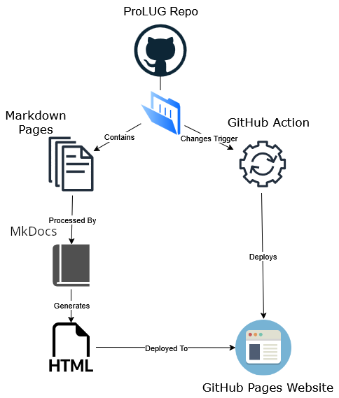

# Contributing and Local Development

It is strongly encouraged that contributors test their changes before making commits. To help
facilitate this process a set of instructions and guidelines are provided below. These guidelines
are by no means a requirement or the only set of procedures to locally develop on this project.

The examples, code, and commands provided below were developed using such technologies as containers,
bash scripts, and more.

## Build Dependencies

The ProLUG course books utilize [Material for MkDocs](https://squidfunk.github.io/mkdocs-material/), a friendly
and popular markdown utility that quickly exports static web files for documentation or general website use cases.

Utilizing Material for MkDocs this course then deploys the exported web structure to a Git Pages workflow and runner
that then produces an easily navigable website.

Below is the current workflow that deploys the Git Page for the courses:

<figure markdown="span">



</figure>

To begin developing locally on this project Material for MkDocs has provided a pre-baked Docker image. Or contributors
can utilize a virtual python environment with the required dependencies.

!!! info inline end "Local Dependencies"

    - httpd or apache2
    - git
    - python3>=.8
    - python virtual environment with mkdoc-material required pip packages
    - a clone of the [ProLUG course-books repository](https://github.com/ProfessionalLinuxUsersGroup/course-books)

To achieve this deployment locally without deploying the suggested Materials for MkDocs Docker image the following
environment and dependencies are required: A localhost, this could be a container, virtual machine, or local machine,
and the following packages installed on such machine. :material-arrow-right-box:


More information to get started is provided by Material for MkDocs here: <https://squidfunk.github.io/mkdocs-material/getting-started/>

## Building, Deploying, and Developing Locally

Below is a set of scripts that can quickly achieve this environment in an automated fashion if contributors
choose to forgo utilizing the provided Docker image.

These commands assume a `root` user. These scripts will update host package repositories to
their latest offerings and download missing dependencies, insantiate the python virtual environment
required to build the project, process and produce the necessary `.html` files from the course book
source files, and deploy the website either via `httpd/apache2` or served via the built-in development server.

Outside of system packages all files will be localized to the `/root/course-books` directory
on the container or machine.

=== "APT"

    ```bash
    #!/bin/bash
    apt-get update && apt-get -y install git python3 hostname apache2
    git clone https://github.com/ProfessionalLinuxUsersGroup/course-books && cd course-books
    python3 -m venv . && source "$PWD"/bin/activate
    pip install -U pip && pip install -U mkdocs mkdocs-material mkdocs-glightbox
    # use mkdocs serve -a "$(hostname -I | awk '{print $1}'):8000" for live reloading after changes
    mkdocs build -d /var/www/html/ && systemctl enable --now apache2
    ```

=== "DNF"

    ```bash
    #!/bin/bash
    dnf install -y httpd git python3 hostname httpd
    git clone https://github.com/ProfessionalLinuxUsersGroup/course-books && cd course-books
    python3 -m venv . && source "$PWD"/bin/activate
    pip install -U pip && pip install -U mkdocs mkdocs-material mkdocs-glightbox
    # use mkdocs serve -a "$(hostname -I | awk '{print $1}'):8000" for live reloading after changes
    mkdocs build -d /var/www/html/ && systemctl enable --now httpd
    ```

The ProLUG Linux Course Books website should now be available from your web browser either at
<http://localhost> or its designated IP address.

From here you can use such commands from your localhost to implement changes:

```bash
cd "$HOME"/course-books && source bin/activate
mkdocs build -d /var/www/html
systemctl restart {httpd or apache}
```

These commands will switch your shell into the appropriate directory, activate the python
virtual environment, execute the necessary mkdocs binary located in its installed virtual $PATH,
build the site from the source files, and then finally restart the web server.

From there you should be able to see any changes you have made are reflected.

Or send commands over to a networked container or machine:

!!! note

    To minimize complexity and given the nature of commands over SSH,
    these commands will need to utilize absolute paths.

```bash
scp {working directory}/{targeted document} {TARGET_IP}:/root/course-books/{targeted document}
ssh {TARGET_IP} "cd /root/course-books && /root/course-books/bin/mkdocks build -d /var/www/html && systemctl restart httpd"
```
