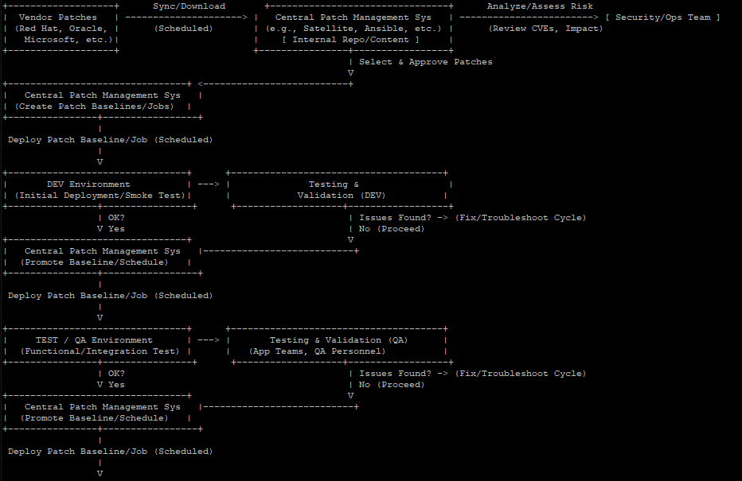
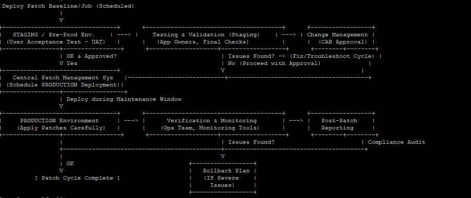

# Unit 11 Worksheet

## Instructions

Fill out the worksheet as you progress through the lab and discussions.
Hold your worksheets until the end to turn them in as a final submission packet.

### Resources / Important Links

- <https://nvlpubs.nist.gov/nistpubs/SpecialPublications/NIST.SP.800-223.ipd.pdf>
- <https://killercoda.com/het-tanis/course/Automation-Labs/Unit11_Update_and_Patch_Systems>

#### Downloads

The worksheet has been provided below. The document(s) can be transposed to
the desired format so long as the content is preserved. For example, the `.txt`
could be transposed to a `.md` file.

- <a href="https://professionallinuxusersgroup.github.io/course-books/assets/pcae/downloads/u11/u11_worksheet.md.txt" target="_blank">📥 u11_worksheet(`.md`)</a>
- <a href="https://professionallinuxusersgroup.github.io/course-books/assets/pcae/downloads/u11/u11_worksheet.txt" target="_blank">📥 u11_worksheet(`.txt`)</a>
- <a href="https://professionallinuxusersgroup.github.io/course-books/assets/pcae/downloads/u11/u11_worksheet.pdf" target="_blank">📥 u11_worksheet(`.pdf`)</a>

### Unit 11 Recording

<!-- <iframe -->
<!--     style="width: 100%; height: 100%; border: none; -->
<!--     aspect-ratio: 16/9; border-radius: 0.25rem; background:black" -->
<!--     src="" -->
<!--     title="" -->
<!--     frameborder="0" -->
<!--     allow="accelerometer; autoplay; clipboard-write; encrypted-media; gyroscope; picture-in-picture; web-share" -->
<!--     referrerpolicy="strict-origin-when-cross-origin" -->
<!--     allowfullscreen> -->
<!-- </iframe> -->

Link: Coming soon

#### Discussion Post #1

!!! scenario

    In your lab, you have patched a Warewulf image. Compare that against how you’ve patched running systems and think about the differences.

1. Can you enumerate the differences between live system patching and image patching?
    - What are the similarities between them?
2. Are the types of repositories that you use different between live system patching and image patching? Why or why not?

#### Discussion Post #2

!!! scenario

    Review the images of the patching methodology that your company uses.
    
    

1. Do you understand the flow well enough to talk to it with another manager?
2. What type of testing might you do in each of the environments?
    - a. Would all the testing be the same?
       - i. If so, why?
       - ii. If not, how is it different

!!! info

    Submit your input by following the link. The discussion posts are done in Discord Forums.  
    [:fontawesome-brands-discord: Link to Discussion Posts](https://discord.com/channels/611027490848374811/1365776270800977962)

## Definitions

- Patching
- Repos
    - Software
    - EPEL
    - BaseOS v. Appstream (in RHEL/Rocky)
    - Other types you can find?
- httpd
- patching
- GPG Key
- DNF/YUM

## Digging Deeper

1. Read other parts of this doc for more HPC understanding: <https://nvlpubs.nist.gov/nistpubs/SpecialPublications/NIST.SP.800-223.ipd.pdf>
    - 1. What are the components on the drawing on page 3 of doc (pg. 11 in the web viewer)

## Reflection Questions

1. What questions do you still have about this week?
2. How are you going to use what you’ve learned in your current role?
