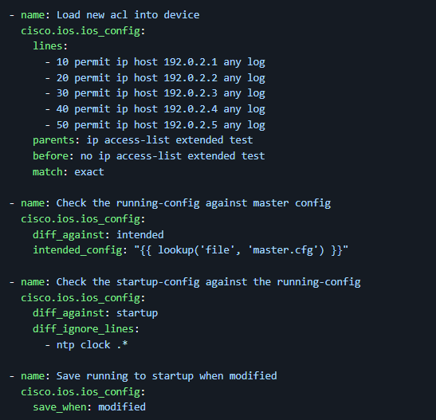

# Unit 12 Worksheet

## Instructions

Fill out the worksheet as you progress through the lab and discussions.
Hold your worksheets until the end to turn them in as a final submission packet.

### Resources / Important Links

- <https://nvlpubs.nist.gov/nistpubs/SpecialPublications/NIST.SP.800-223.ipd.pdf>
- <https://docs.ansible.com/projects/ansible/latest/collections/cisco/ios/index.html>
- <https://www.pulumi.com/guides/tags/networking/>

#### Downloads

The worksheet has been provided below. The document(s) can be transposed to
the desired format so long as the content is preserved. For example, the `.txt`
could be transposed to a `.md` file.

- <a href="https://professionallinuxusersgroup.github.io/course-books/assets/pcae/downloads/u12/u12_worksheet.md.txt" target="_blank">📥 u12_worksheet(`.md`)</a>
- <a href="https://professionallinuxusersgroup.github.io/course-books/assets/pcae/downloads/u12/u12_worksheet.txt" target="_blank">📥 u12_worksheet(`.txt`)</a>
- <a href="https://professionallinuxusersgroup.github.io/course-books/assets/pcae/downloads/u12/u12_worksheet.pdf" target="_blank">📥 u12_worksheet(`.pdf`)</a>

### Unit 12 Recording

<!-- <iframe -->
<!--     style="width: 100%; height: 100%; border: none; -->
<!--     aspect-ratio: 16/9; border-radius: 0.25rem; background:black" -->
<!--     src="" -->
<!--     title="" -->
<!--     frameborder="0" -->
<!--     allow="accelerometer; autoplay; clipboard-write; encrypted-media; gyroscope; picture-in-picture; web-share" -->
<!--     referrerpolicy="strict-origin-when-cross-origin" -->
<!--     allowfullscreen> -->
<!-- </iframe> -->

Link: Coming soon

#### Discussion Post #1

!!! scenario

    You have a set of older routers that have been traditionally
    connected to and configured over ssh via the command line (CLI) in Cisco Internetwork
    Operating System (IOS). You decide to backup the current configs of all routers with
    Ansible.

    

1. How might you lay out the cisco.ios.ios_config module to backup up everything to a local folder on your jump server?

#### Discussion Post #2

!!! scenario

    You’ve read that software defined networking (SDN) is the new
    hotness in the network engineering world. Your organization mostly uses VPC’s inside of
    AWS and you want to learn more about what SDN means in the cloud.

1. Can you find some good SDN configuration blogs about the topic and prepare a couple paragraphs for a memo to your other engineers on the team?

!!! info

    Submit your input by following the link. The discussion posts are done in Discord Forums.  
    [:fontawesome-brands-discord: Link to Discussion Posts](https://discord.com/channels/611027490848374811/1365776270800977962)

## Definitions

- SDN – (any related terminology)
    - Control Plane

## Digging Deeper

1. Read about a SDN tool that is useful in infrastructure: <https://www.pulumi.com/guides/tags/networking/>

## Reflection Questions

1. What questions do you still have about this week?
2. How are you going to use what you’ve learned in your current role?
